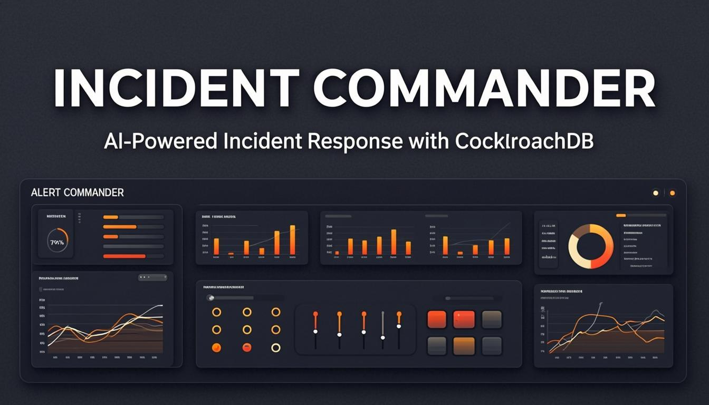
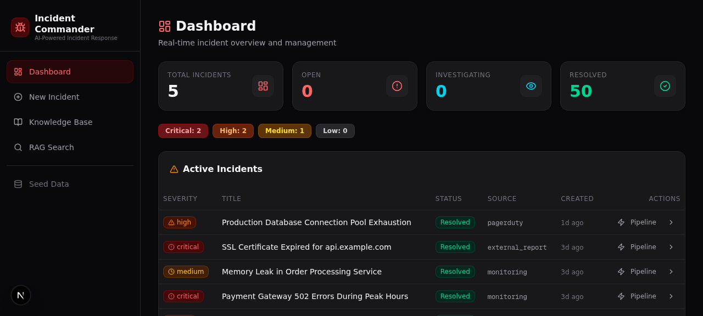
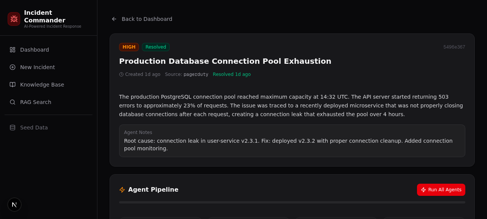

# 🪳 Incident Commander

**AI-Powered Incident Response with Persistent Agentic Memory**

Built for the [CockroachDB × AWS Hackathon: Build with Agentic Memory](https://cockroachdb-ai.devpost.com/)

**🚀 Live Demo:** [https://incident-commander-dun.vercel.app](https://incident-commander-dun.vercel.app)



## Overview

Incident Commander is a multi-agent AI system that autonomously triages, investigates, resolves, and generates post-mortems for production incidents. It uses **CockroachDB as the persistent memory layer** — every incident, agent action, and vector embedding is stored in CockroachDB's globally distributed database, enabling agents to learn from every past incident via RAG (Retrieval-Augmented Generation).

## Architecture

```
┌─────────────────────────────────────────────┐
│           Next.js 16 Frontend               │
│  Dashboard │ Incident Detail │ Knowledge Base │
└──────────────────┬──────────────────────────┘
                   │ API Routes
     ┌─────────────┼─────────────┐
     ▼             ▼             ▼
┌─────────┐  ┌──────────┐  ┌────────┐
│ Bedrock │  │CockroachDB│  │  S3   │
│ (Claude)│  │           │  │(artifacts)│
│ 4 Agents│  │ ┌───────┐ │  │        │
│         │  │ │incidents│ │  │        │
│ Triage  │  │ │actions  │ │  │        │
│Investigate│ │ │runbooks │ │  │        │
│ Resolve │  │ │vectors──│─┼─ pgvector │
│PostMortem│ │ │sessions │ │  │   RAG  │
└─────────┘  │ └───────┘ │  │        │
             └──────────┘  └────────┘
```

## Key Features

- **4-Agent Pipeline**: Triage → Investigate → Resolve → Post-Mortem
- **RAG-Powered Memory**: Vector similarity search across past incidents and runbooks
- **AWS Bedrock Integration**: Claude Sonnet 4 powers all agent reasoning
- **S3 Artifact Storage**: Post-mortem reports and agent outputs stored in S3
- **Real-Time Dashboard**: Dark "mission control" UI with severity tracking

## Tech Stack

| Component | Technology |
|-----------|-----------|
| Frontend | Next.js 16, TypeScript, Tailwind CSS 4, shadcn/ui |
| Backend | Next.js API Routes |
| Database | CockroachDB Cloud with pgvector |
| Vector Index | CockroachDB Distributed Vector Index (VECTOR(1536)) |
| LLM | AWS Bedrock (Claude Sonnet 4) |
| Storage | AWS S3 |

## CockroachDB Tools Used

### 1. Distributed Vector Indexing (pgvector)
All incident descriptions, resolutions, and runbooks are embedded as 1536-dimensional vectors. CockroachDB's native vector index enables sub-second similarity search across thousands of records, powering the RAG pipeline that makes agents smarter with every incident.

### 2. CockroachDB Cloud (Persistent Agentic Memory)
All incident state, agent actions, runbooks, and session data is stored in CockroachDB's globally distributed database. This is the system of record for the agents — their memory never goes down.

## AWS Services Used

### 1. Amazon Bedrock (Claude Sonnet 4)
All four agents use Claude via Bedrock for reasoning:
- **Triage Agent**: Classifies severity, identifies similar past incidents
- **Investigation Agent**: Searches runbooks via RAG, determines root cause
- **Resolution Agent**: Executes remediation plan
- **Post-Mortem Agent**: Generates comprehensive post-mortem reports

### 2. Amazon S3
Stores incident artifacts including:
- Agent triage reports (JSON)
- Investigation results (JSON)
- Resolution summaries (JSON)
- Post-mortem reports (Markdown)

## Database Schema

```sql
-- Core incident tracking
CREATE TABLE incidents (
    id UUID PRIMARY KEY DEFAULT gen_random_uuid(),
    title STRING, description STRING,
    severity STRING CHECK (severity IN ('critical','high','medium','low')),
    status STRING CHECK (status IN ('open','triaging','investigating','resolving','resolved','post_mortem')),
    agent_notes STRING, resolution_summary STRING
);

-- Vector embeddings for RAG
CREATE TABLE incident_embeddings (
    id UUID PRIMARY KEY DEFAULT gen_random_uuid(),
    incident_id UUID REFERENCES incidents(id),
    content_chunk STRING,
    embedding VECTOR(1536) NOT NULL,
    chunk_type STRING
);
CREATE VECTOR INDEX idx_incident_vec ON incident_embeddings (embedding);

-- Knowledge base with vector search
CREATE TABLE runbooks (
    id UUID PRIMARY KEY DEFAULT gen_random_uuid(),
    title STRING, content STRING, category STRING,
    embedding VECTOR(1536)
);
CREATE VECTOR INDEX idx_runbook_vec ON runbooks (embedding);
```

## Getting Started

### Prerequisites
- Node.js 18+ / Bun
- CockroachDB Cloud account (free tier)
- AWS account with Bedrock and S3 access

### Setup

1. **Clone the repo**
```bash
git clone https://github.com/icohangar-ops/incident-commander.git
cd incident-commander
```

2. **Install dependencies**
```bash
bun install
```

3. **Configure environment**
```bash
cp .env.example .env.local
# Edit .env.local with your CockroachDB and AWS credentials
```

4. **Set up CockroachDB**
```sql
CREATE EXTENSION IF NOT EXISTS vector;
-- Run the schema from docs/schema.sql
```

5. **Start the development server**
```bash
bun run dev
```

6. **Seed sample data**
```bash
curl -X POST http://localhost:3000/api/seed
```

## Screenshots

### Dashboard


### Incident Detail & Agent Pipeline


## Demo Video

[Watch the 3-minute demo](assets/incident-commander-demo.webm)

## How It Works

### Agent Pipeline Flow

1. **Incident Created** → Stored in CockroachDB with vector embedding
2. **Triage Agent** (Bedrock Claude):
   - Embeds incident description
   - Vector search finds similar past incidents
   - Classifies severity and recommends actions
   - Stores results in CockroachDB + S3
3. **Investigation Agent** (Bedrock Claude):
   - Retrieves relevant runbooks via RAG
   - Cross-references similar incident resolutions
   - Determines root cause hypothesis
4. **Resolution Agent** (Bedrock Claude):
   - Executes remediation based on investigation
   - Stores resolution as new embedding (system learns!)
5. **Post-Mortem Agent** (Bedrock Claude):
   - Reviews entire agent history
   - Generates comprehensive report
   - Uploads to S3

### Why Agentic Memory Matters

Traditional incident management tools treat each incident in isolation. Incident Commander is different: **every resolved incident makes the system smarter**. When a new incident occurs, the agents search through all past incidents and runbooks using vector similarity, finding relevant context that helps them respond faster and more accurately.

## Project Structure

```
src/
├── lib/
│   ├── types.ts          # TypeScript interfaces
│   ├── cockroachdb.ts    # Database connection & helpers
│   ├── bedrock.ts        # AWS Bedrock Claude integration
│   ├── s3.ts             # AWS S3 artifact storage
│   └── agents.ts         # 4 agent implementations + RAG
├── app/
│   ├── page.tsx          # Main entry point
│   ├── layout.tsx        # Root layout
│   └── api/
│       ├── incidents/    # CRUD + agent endpoints
│       ├── runbooks/     # Knowledge base
│       ├── rag/search/   # Vector similarity search
│       └── seed/         # Sample data seeder
└── components/
    ├── incident-commander.tsx   # Main app shell
    ├── incident-dashboard.tsx   # Dashboard view
    ├── incident-detail.tsx      # Detail + agent pipeline
    ├── incident-form.tsx        # Create incident
    ├── knowledge-base.tsx       # Runbooks
    └── rag-search.tsx           # RAG search
```

## Hackathon Submission Checklist

- [x] Open source with MIT license
- [x] Public GitHub repository
- [x] Uses CockroachDB Distributed Vector Indexing
- [x] Uses CockroachDB Cloud as persistent memory
- [x] Uses AWS Bedrock (Claude) for agent reasoning
- [x] Uses AWS S3 for artifact storage
- [x] Functional demo app
- [x] Demo video (< 3 minutes)
- [x] Clear README with setup instructions

## License

[MIT](LICENSE)